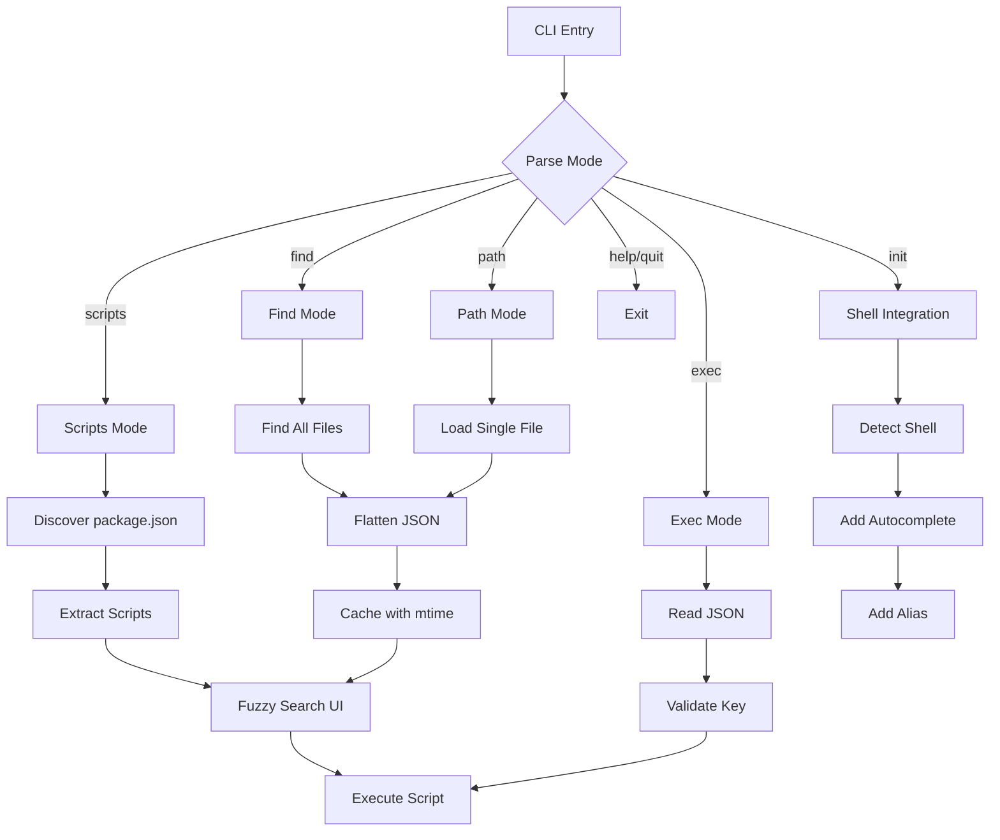

# fjsf

[](https://www.npmjs.com/package/fjsf)
[](https://github.com/yowainwright/fjsf/actions)
[](https://codecov.io/gh/yowainwright/fjsf)

> ### Fuzzy JSON Search & Filter

A zero-dependency CLI tool for fuzzy searching and executing scripts within json. This is especially useful for exploring `package.json` fields with dot notation, and querying any JSON config files across monorepos and regular projects.

### Traverse. Search. Execute. Fuzzy search filter your JSON files in style. 🤘


## Why fjsf?

**Stop typing full script names.** Run `fjsf init` once, then just type `npm run <TAB>` and get an interactive tooltip with all your scripts. That's it. No more:

- Typing `npm run test:unit:watch:verbose`
- Opening `package.json` to remember script names
- Scrolling through `npm run` help text
- Context switching between editor and terminal

Type less. Run faster. Stay in flow.

## Architecture

<p align="center">You start here. <br/> Lost. In a sea of monorepo workspaces trying to remember the script you need,<br />you type <code>fjsf</code> and...</p>



<p align=center>You end here.<br />Just as lonely as before.<br />But you executed that npm script you needed lickety-split!</p>

## Features

- **Shell Integration**: Interactive tooltip when you type `npm run <TAB>` - fuzzy search scripts without leaving your terminal
- **Scripts Mode**: Fuzzy search and execute npm scripts
- **Find Mode**: Find all versions of a file across your repo and fuzzy search their JSON
- **Path Mode**: Query a specific JSON file with fuzzy search
- **Exec Mode**: Execute specific keys from JSON files directly
- **Smart Caching**: JSON files are cached in memory with mtime validation for instant searches
- Supports monorepos with workspaces (npm, pnpm, yarn, bun)
- Automatic package manager detection
- Zero dependencies - built with Bun
- Interactive terminal UI with keyboard navigation
- Shows which workspace and file each entry belongs to

## Usage

### Scripts Mode (Default)

Search and execute npm scripts from package.json:

```bash
fjsf                    # Search all package.json scripts
fjsf <package.json>     # Search specific package.json file
```

### Find Mode

Find all versions of a file across your repo and fuzzy search their JSON:

```bash
fjsf find <filename>    # Find all files with this name
fjsf f <filename>       # Short form
```

Examples:

```bash
fjsf find package.json    # Find all package.json files, search their contents
fjsf f tsconfig.json      # Find all tsconfig.json files
fjsf find .eslintrc.json  # Find all .eslintrc.json files
```

This will:

1. Find ALL files matching the name across your repo (including workspaces)
2. Flatten all their JSON into dot-notation paths
3. Let you fuzzy search across ALL fields from ALL found files
4. Show which file/workspace each result comes from

Search examples once in find mode:

- Type `react` - View all React dependencies across all package.json files
- Type `version` - Check versions across workspaces
- Type `compilerOptions.target` - See all TS targets in tsconfigs
- Type `scripts.test` - Find all test scripts

### Path Mode

Query a specific JSON file (single file):

```bash
fjsf path <file>        # Query a specific JSON file
fjsf p <file>           # Short form
```

Examples:

```bash
fjsf path ./tsconfig.json       # Query single tsconfig.json
fjsf p ./package.json           # Query single package.json
fjsf path ./config/app.json     # Query any JSON file
```

This mode:

1. Loads ONE specific JSON file
2. Flattens it into dot-notation paths
3. Provides fuzzy search across all fields in that file

### Exec Mode

Execute a specific key from a JSON file:

```bash
fjsf exec <file> <key>     # Execute a key (scripts only)
fjsf e <file> <key>        # Short form
```

Examples:

```bash
fjsf exec package.json scripts.build    # Run the build script
fjsf e package.json scripts.test        # Run the test script
fjsf e package.json scripts.dev         # Run the dev script
```

Note: Can only execute keys that start with `scripts.` and have string values.

### Shell Integration

Never need to ask, "what was that npm script again?" again!

```bash
fjsf init
```

After setup, restart your shell. Now the magic happens:

```bash
npm run <TAB>       # Interactive tooltip appears!
                    # Shows: test, build, dev, lint...
                    # Type to filter, arrow keys to navigate, Enter to run

npm run t<TAB>      # Shows: test, test:watch, typecheck...
pnpm run bui<TAB>   # Shows: build, build:prod, build:dev...
yarn run d<TAB>     # Shows: dev, deploy, docs...
bun run li<TAB>     # Shows: lint, lint:fix...
```

**How it works:**

`fjsf init` creates a `~/.fjsf/` directory with shell-specific integration files and adds a single source line to your shell config (`.zshrc`, `.bashrc`, or `.config/fish/config.fish`).

- Type `npm run` (or pnpm/yarn/bun) followed by optional partial script name
- Press **Tab** to trigger the interactive tooltip
- The tooltip appears right at your cursor showing fuzzy-matched scripts
- Your partial input becomes the fuzzy search query
- Arrow up/down to navigate matches
- Press Enter to execute the selected script
- The same fjsf interface you know, but inline in your terminal

**Clean uninstall:**
```bash
rm -rf ~/.fjsf
# Then remove the "# fjsf" and source line from your shell config
```

**Why this is awesome:**

- No context switching - stays in your terminal flow
- Fuzzy matching means `npm run t` finds `test`, `typecheck`, `test:watch`
- Works across all package managers (npm, pnpm, yarn, bun)
- Shows workspace info in monorepos
- Zero dependencies, instant performance

Supports: bash, zsh, fish

**Customizing the key binding:**

If Tab conflicts with other completions (like bun's native completions), you can change the key binding. After running `fjsf init`, edit the integration file in `~/.fjsf/`:

**Zsh** (`~/.fjsf/init.zsh`):

```bash
bindkey '^I' _fjsf_widget      # Change to your preferred key
# Examples: '^F' (Ctrl+F), '^G' (Ctrl+G)
```

**Bash** (`~/.fjsf/init.bash`):

```bash
bind -x '"\\C-i": _fjsf_complete'   # Change to your preferred key
# Examples: '"\\C-f"' (Ctrl+F), '"\\C-g"' (Ctrl+G)
```

**Fish** (`~/.fjsf/init.fish`):

```bash
bind \t _fjsf_widget      # Change to your preferred key
# Examples: \cf (Ctrl+F), \cg (Ctrl+G)
```

Common key bindings: `^I`/`\t` (Tab), `^F`/`\cf` (Ctrl+F), `^G`/`\cg` (Ctrl+G)

### Help & Quit

```bash
fjsf help               # Show help
fjsf h                  # Short form
fjsf quit               # Exit gracefully
fjsf q                  # Short form
```

### Keyboard Controls

- Type to search (fuzzy matching)
- `↑/↓` - Navigate through results
- `Enter` - Execute selected script (scripts mode only)
- `q`, `Esc` or `Ctrl+C` - Exit

## Modes

**Scripts Mode:**

1. Discovers all `package.json` files in your repository
2. Extracts scripts from each package
3. Detects your package manager (bun, pnpm, yarn, or npm)
4. Provides fuzzy search across script names and workspaces
5. Executes scripts with the correct package manager command

**Find Mode:**

1. Searches your repository for all files matching the given filename
2. Flattens all found JSON files into searchable dot-notation paths
3. Caches JSON with mtime validation for fast subsequent searches
4. Provides fuzzy search across paths, keys, and values from ALL found files
5. Shows which file/workspace each entry belongs to

**Exec Mode:**

1. Reads the specified JSON file
2. Navigates to the specified key using dot notation
3. Validates the key is a script (starts with `scripts.`)
4. Executes the script with the appropriate package manager

## Installation

### npm

```bash
bun install -g fjsf
```

### Homebrew

```bash
brew tap yowainwright/fjsf
brew install fjsf
```

### Binary

Download the latest binary for your platform from the [releases page](https://github.com/yowainwright/fjsf/releases):

- Linux: `fjsf-linux-x64`
- macOS (Intel): `fjsf-darwin-x64`
- macOS (ARM): `fjsf-darwin-arm64`
- Windows: `fjsf-windows-x64.exe`

Make the binary executable and move it to your PATH:

```bash
chmod +x fjsf-*
sudo mv fjsf-* /usr/local/bin/fjsf
```

## License

MIT
