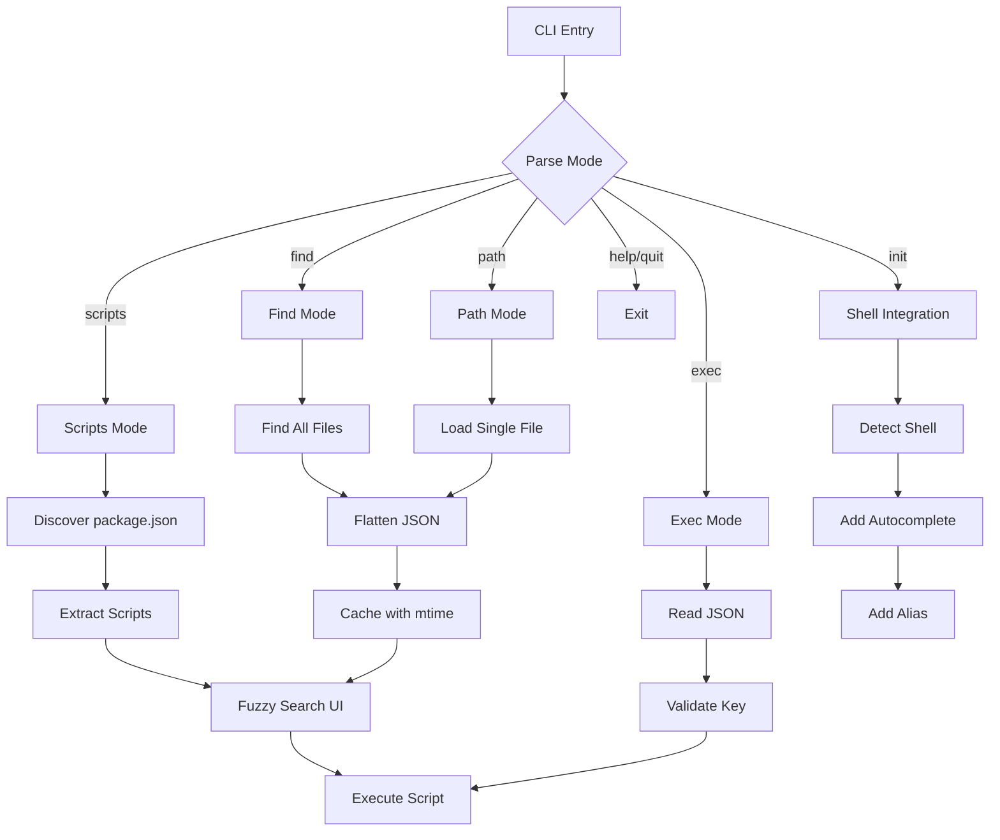

# fjsf

[](https://www.npmjs.com/package/fjsf)
[](https://github.com/yowainwright/fjsf/actions)
[](https://codecov.io/gh/yowainwright/fjsf)

> ### Fuzzy JSON Search & Filter

A zero-dependency CLI tool for fuzzy searching and executing scripts within json. This is especially useful for exploring `package.json` fields with dot notation, and querying any JSON config files across monorepos and regular projects.

### Traverse. Search. Execute. Fuzzy search filter your JSON files in style. 🤘


## Why fjsf?

**Stop typing full script names.** Run `fjsf init` once, then just type `npm run <TAB>` and get an interactive tooltip with all your scripts. That's it.

No more:

- Typing `npm run test....<you forgot>`
- Opening `package.json` to remember script names
- Context switching between text and terminal

Type less. Run faster. Stay in flow.

## Architecture

<p align="center">You start here. <br/> Lost. In a sea of monorepo workspaces trying to remember the script you need,<br />you type <code>fjsf</code> and...</p>



<p align=center>You end here.<br />Just as lonely as before.<br />But you executed that npm script you needed lickety-split!</p>

## Features

- **Shell Integration**: Interactive tooltip when you type `npm run <TAB>` - fuzzy search scripts without leaving your terminal
- **Scripts Mode**: Fuzzy search and execute npm scripts
- **Find Mode**: Find all versions of a file across your repo and fuzzy search their JSON
- **Path Mode**: Query a specific JSON file with fuzzy search
- **Exec Mode**: Execute specific keys from JSON files directly
- **Smart Caching**: JSON files are cached in memory with mtime validation for instant searches
- Supports monorepos with workspaces (npm, pnpm, yarn, bun)
- Automatic package manager detection
- Zero dependencies - built with Bun
- Interactive terminal UI with keyboard navigation
- Shows which workspace and file each entry belongs to

## Recipes

### Shell Integration - Never Type Full Script Names Again

Setup once:

```bash
fjsf init               # Supports bash, zsh, fish
# Restart your shell
```

Now type `npm run <TAB>` for instant fuzzy search:

```bash
npm run <TAB>
# Interactive fuzzy search appears:
# ❯ dev
#   build
#   test
#   lint

npm run t<TAB>
# Filters to:
# ❯ test
#   test:e2e
#   typecheck

bun run bui<TAB>
# Shows:
# ❯ build
#   build:binary
#   build:all
```

Works with npm, pnpm, yarn, and bun. Press Tab to search, arrow keys to navigate, Enter to run.

**Using with fzf-tab?** Run `fjsf init --native` instead.

**Customize key binding:** Edit `~/.fjsf/init.{zsh,bash,fish}` and change the bindkey (default is Tab/`^I`).

**Uninstall:** `rm -rf ~/.fjsf` and remove the source line from your shell config.

### Search & Execute Scripts

```bash
fjsf                    # Search all scripts in current repo
fjsf ./package.json     # Search scripts in specific file
```

### Audit Dependencies Across Monorepo

```bash
fjsf find package.json
# Type: "react"
# Shows: dependencies.react:[workspace-a] ^18.2.0
#        dependencies.react:[workspace-b] ^18.0.0
#        devDependencies.react:[workspace-c] ^17.0.2
```

### Check Configuration Consistency

```bash
fjsf find tsconfig.json
# Type: "target"
# Shows: compilerOptions.target:[packages/api] ES2020
#        compilerOptions.target:[packages/web] ES2022
```

### Discover Scripts Across Workspaces

```bash
fjsf find package.json
# Type: "scripts.test"
# Shows: scripts.test:[workspace-a] jest
#        scripts.test:[workspace-b] vitest
```

### Query Specific Config File

```bash
fjsf path ./tsconfig.json
# Type: "strict"
# Shows: compilerOptions.strict: true
```

### Execute Script Directly

```bash
fjsf exec package.json scripts.build    # Run build script
fjsf e package.json scripts.test        # Run test (short form)
```

## Command Reference

```bash
# Scripts mode (default)
fjsf [file]             # Search & execute scripts

# Find mode - search all files with name
fjsf find <filename>    # fjsf find package.json
fjsf f <filename>       # Short form

# Path mode - query single file
fjsf path <file>        # fjsf path ./tsconfig.json
fjsf p <file>           # Short form

# Exec mode - run script directly
fjsf exec <file> <key>  # fjsf exec package.json scripts.dev
fjsf e <file> <key>     # Short form

# Shell integration
fjsf init               # Setup Tab completion
fjsf init --native      # For fzf-tab users

# Keyboard controls
# Type to search (fuzzy), ↑/↓ to navigate, Enter to execute, q/Esc/Ctrl+C to quit
```

## Installation

### npm

```bash
bun install -g fjsf
```

### Homebrew

```bash
brew tap yowainwright/fjsf
brew install fjsf
```

### Binary

Download the latest binary for your platform from the [releases page](https://github.com/yowainwright/fjsf/releases):

- Linux: `fjsf-linux-x64`
- macOS (Intel): `fjsf-darwin-x64`
- macOS (ARM): `fjsf-darwin-arm64`
- Windows: `fjsf-windows-x64.exe`

Make the binary executable and move it to your PATH:

```bash
chmod +x fjsf-*
sudo mv fjsf-* /usr/local/bin/fjsf
```

## Troubleshooting

**Tab completions not working:** Ensure completion files are loaded before `compinit` in your shell config. Clear cache with `rm -rf ~/.zcompdump*` and reload.

## License

MIT
