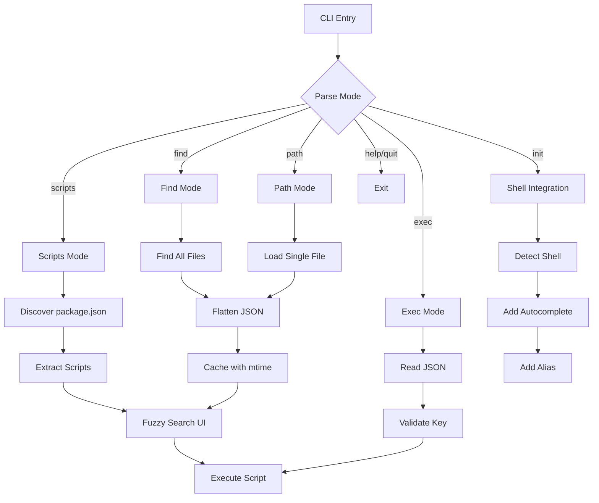

# fjsf (Fuzzy JSON Search & Filter)

A zero-dependency CLI tool for fuzzy searching and executing npm scripts, exploring package.json fields with dot notation, and querying any JSON config files across monorepos and regular projects.

## Features

- **Scripts Mode**: Fuzzy search and execute npm scripts
- **Find Mode**: Find all versions of a file across your repo and fuzzy search their JSON
- **Path Mode**: Query a specific JSON file with fuzzy search
- **Exec Mode**: Execute specific keys from JSON files directly
- **Smart Caching**: JSON files are cached in memory with mtime validation for instant searches
- Supports monorepos with workspaces (npm, pnpm, yarn, bun)
- Automatic package manager detection
- Zero dependencies - built with Bun
- Interactive terminal UI with keyboard navigation
- Shows which workspace and file each entry belongs to

## Installation

### npm

```bash
npm install -g fjsf
```

### Homebrew

```bash
brew tap yowainwright/fjsf
brew install fjsf
```

### Binary

Download the latest binary for your platform from the [releases page](https://github.com/yowainwright/fjsf/releases):

- Linux: `fjsf-linux-x64`
- macOS (Intel): `fjsf-darwin-x64`
- macOS (ARM): `fjsf-darwin-arm64`
- Windows: `fjsf-windows-x64.exe`

Make the binary executable and move it to your PATH:

```bash
chmod +x fjsf-*
sudo mv fjsf-* /usr/local/bin/fjsf
```

## Usage

### Scripts Mode (Default)

Search and execute npm scripts from package.json:

```bash
fjsf                    # Search all package.json scripts
fjsf <package.json>     # Search specific package.json file
```

### Find Mode

Find all versions of a file across your repo and fuzzy search their JSON:

```bash
fjsf find <filename>    # Find all files with this name
fjsf f <filename>       # Short form
```

Examples:

```bash
fjsf find package.json    # Find all package.json files, search their contents
fjsf f tsconfig.json      # Find all tsconfig.json files
fjsf find .eslintrc.json  # Find all .eslintrc.json files
```

This will:

1. Find ALL files matching the name across your repo (including workspaces)
2. Flatten all their JSON into dot-notation paths
3. Let you fuzzy search across ALL fields from ALL found files
4. Show which file/workspace each result comes from

Search examples once in find mode:

- Type `react` - View all React dependencies across all package.json files
- Type `version` - Check versions across workspaces
- Type `compilerOptions.target` - See all TS targets in tsconfigs
- Type `scripts.test` - Find all test scripts

### Path Mode

Query a specific JSON file (single file):

```bash
fjsf path <file>        # Query a specific JSON file
fjsf p <file>           # Short form
```

Examples:

```bash
fjsf path ./tsconfig.json       # Query single tsconfig.json
fjsf p ./package.json           # Query single package.json
fjsf path ./config/app.json     # Query any JSON file
```

This mode:

1. Loads ONE specific JSON file
2. Flattens it into dot-notation paths
3. Provides fuzzy search across all fields in that file

### Exec Mode

Execute a specific key from a JSON file:

```bash
fjsf exec <file> <key>     # Execute a key (scripts only)
fjsf e <file> <key>        # Short form
```

Examples:

```bash
fjsf exec package.json scripts.build    # Run the build script
fjsf e package.json scripts.test        # Run the test script
fjsf e package.json scripts.dev         # Run the dev script
```

Note: Can only execute keys that start with `scripts.` and have string values.

### Shell Integration

Setup shell integration for autocomplete and shortcuts:

```bash
fjsf init               # Setup autocomplete and fj alias
```

This command will:

1. Detect your shell (bash, zsh, or fish)
2. Add autocomplete for fjsf commands
3. Add `fj` alias for quick access (if not already in use)
4. Update your shell config file automatically

After running, restart your shell or run:

```bash
source ~/.zshrc          # zsh
source ~/.bashrc         # bash
source ~/.config/fish/config.fish  # fish
```

Then you can use:

```bash
fj                      # Instead of fjsf
fj find package.json    # Autocomplete for commands
```

### Help & Quit

```bash
fjsf help               # Show help
fjsf h                  # Short form
fjsf quit               # Exit gracefully
fjsf q                  # Short form
```

### Keyboard Controls

- Type to search (fuzzy matching)
- `↑/↓` - Navigate through results
- `Enter` - Execute selected script (scripts mode only)
- `q`, `Esc` or `Ctrl+C` - Exit

## How It Works

**Scripts Mode:**

1. Discovers all `package.json` files in your repository
2. Extracts scripts from each package
3. Detects your package manager (bun, pnpm, yarn, or npm)
4. Provides fuzzy search across script names and workspaces
5. Executes scripts with the correct package manager command

**Find Mode:**

1. Searches your repository for all files matching the given filename
2. Flattens all found JSON files into searchable dot-notation paths
3. Caches JSON with mtime validation for fast subsequent searches
4. Provides fuzzy search across paths, keys, and values from ALL found files
5. Shows which file/workspace each entry belongs to

**Exec Mode:**

1. Reads the specified JSON file
2. Navigates to the specified key using dot notation
3. Validates the key is a script (starts with `scripts.`)
4. Executes the script with the appropriate package manager

## Project Structure

```
src/
├── cli.ts              # Entry point
├── app.ts              # Scripts mode application
├── modes.ts            # Mode detection and configuration
├── types.ts            # TypeScript types
├── discover.ts         # Package.json discovery (scripts)
├── cache.ts            # JSON file caching with mtime validation
├── fuzzy.ts            # Fuzzy search algorithm
├── search.ts           # Search state management
├── state.ts            # Application state
├── renderer.ts         # Scripts mode UI rendering
├── input.ts            # Keyboard input handling
├── executor.ts         # Script execution
├── terminal.ts         # Terminal utilities
├── package-manager.ts  # Package manager detection
└── json/
    ├── app.ts          # JSON explorer mode application
    ├── discover.ts     # JSON discovery and flattening
    ├── entry.ts        # JSON entry types and flattening logic
    └── renderer.ts     # JSON mode UI rendering
```

## Architecture



## License

MIT
