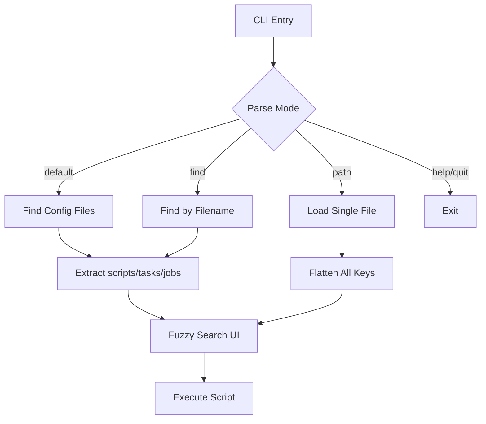

# fjsf

[](https://www.npmjs.com/package/fjsf)
[](https://github.com/yowainwright/fjsf/actions)

> ### Fuzzy Script Finder

A zero-dependency CLI for fuzzy searching and executing scripts from JSON, TOML, and YAML config files. Works with `package.json`, `Cargo.toml`, `pyproject.toml`, `Taskfile.yml`, and more.


## Why fjsf?

Stop typing full script names. Type `fjsf`, fuzzy search, press Enter.

Works wherever scripts live — npm, Cargo, Python tasks, Go taskfiles — no config needed.

## Architecture

<p align="center">You start here. <br/> Lost. In a sea of config files trying to remember the script you need,<br />you type <code>fjsf</code> and...</p>


```mermaid
graph TD
    A[CLI Entry] --> B{Parse Mode}
    B -->|default| C[Find Config Files]
    B -->|find| D[Find by Filename]
    B -->|path| E[Load Single File]
    B -->|help/quit| F[Exit]

    C --> G[Extract scripts/tasks/jobs]
    D --> G
    G --> H[Fuzzy Search UI]
    H --> I[Execute Script]

    E --> J[Flatten All Keys]
    J --> H
```

<p align="center">You end here.<br />Just as lonely as before.<br />But you executed that script you needed lickety-split!</p>

## Features

- **Multi-format**: reads `package.json`, `Cargo.toml`, `pyproject.toml`, `Taskfile.yml`, GitHub Actions, and any JSON/TOML/YAML config
- **Nested task discovery**: finds `[tool.taskipy.tasks]`, `jobs:`, and other non-standard task paths automatically
- **Default mode**: scans the current directory tree and collects all scripts
- **Find mode**: locates every copy of a filename across a monorepo
- **Path mode**: explores any config file with fuzzy search
- Zero dependencies — compiled to a native binary via QuickJS
- Interactive terminal UI with keyboard navigation

## Usage

```bash
fjsf                        # Search all scripts in current directory tree
fjsf find Cargo.toml        # Find all Cargo.toml files and search their scripts
fjsf path pyproject.toml    # Explore a specific file
```

### Search scripts across any project

```bash
fjsf
# Type to fuzzy filter, arrows to navigate, Enter to run, Esc/Ctrl+C to quit
```

### Find scripts across a monorepo

```bash
fjsf find package.json
# Shows scripts from every package.json found in the tree
```

### Explore a config file

```bash
fjsf path Taskfile.yml
# Type: "build"
# Shows all entries with "build" in the key or value
```

### Python projects with taskipy

```bash
fjsf path pyproject.toml
# Finds tasks under [tool.taskipy.tasks] automatically
```

## Command Reference

```bash
# Default — scan directory for config files and extract scripts
fjsf

# Find mode — locate all files with that name and extract scripts
fjsf find <filename>
fjsf f <filename>

# Path mode — load a single file and fuzzy search all entries
fjsf path <file>
fjsf p <file>

# Other
fjsf help / fjsf --help     # Show usage
fjsf --version / fjsf -v    # Show version
fjsf quit / fjsf q          # Exit

# Keyboard controls
# Type to fuzzy search, ↑/↓ to navigate, Enter to execute
# q to quit (when search is empty), Esc or Ctrl+C to exit anytime
```

## Installation

### Homebrew

```bash
brew tap yowainwright/tap
brew install fjsf
```

### npm

```bash
bun install -g fjsf
# or: npm install -g fjsf
```

### Binary

Download the latest binary from the [releases page](https://github.com/yowainwright/fjsf/releases):

- macOS (Apple Silicon): `fjsf-qjs-darwin-arm64`
- Linux x64: `fjsf-qjs-linux-x64`

```bash
chmod +x fjsf-qjs-*
sudo mv fjsf-qjs-* /usr/local/bin/fjsf
```

## License

MIT
